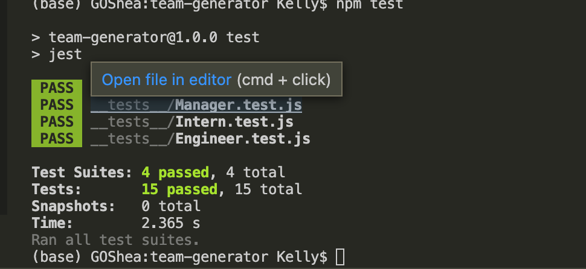

# Team-Generator

## Table of Contents
- [Description] (#description)
- [Installation] (#installation)
- [Usage] (#usage)
- [Questions] (#question)

## Description
This project functions as a Node app that can generate an HTML page, specifcally to track teams and the employees within them.  The user starts the program and is prompted to answers several questions about the members of the team.  Once there are no more members, the user chooses 'none' and the HTML page is generated. 

The project uses Inquirer, Node, and Jest.

## Installation
Clone the repository and install the dependencies (inquirer and jest). 

To start, run command 'node app'

## Usage
### User testing 

### User testing and creating page

Youtube: https://youtu.be/JCG00311ajE

## Questions
Enjoy!
Email: kelwacker@gmail.com
Github: https://github.com/kwax17